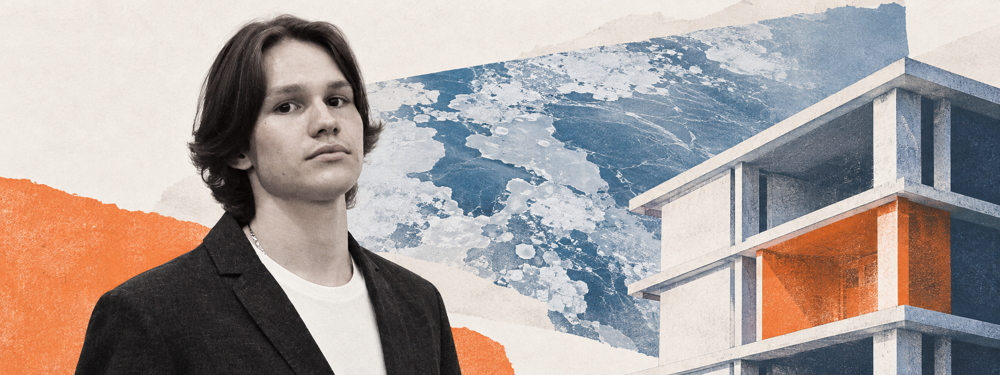
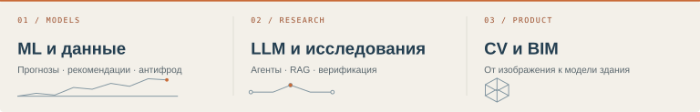

  

# Александр Кондаков

**ML-инженер** · ИТМО, кафедра КТ · Санкт-Петербург

[Почта](mailto:sanchousick-work@outlook.com) &nbsp; / &nbsp; [Telegram](https://t.me/kndch_22) &nbsp; / &nbsp; [Codeforces](https://codeforces.com/profile/Sanchousick) &nbsp; / &nbsp; [OpenReview](https://openreview.net/profile?id=~Aleksandr_Kondakov1)

Создаю ML-системы полного цикла: табличные и последовательностные модели, рекомендательные системы, LLM-агентов и RAG, а также инфраструктуру для их оценки и запуска. Основатель и CTO AI-стартапа, который автоматически формирует ведомости объёмов работ и сметы по 3D/BIM-моделям зданий.

> **Сейчас:** ищу стажировку в ML / LLM / Data Science. Доступен до 40 часов в неделю, офис / гибрид / удалённо.

  

## Результаты

- **1 место** — хакатон AI Business SPb 2026: восстановление пропусков на спутниковых картах ледовой обстановки, ResNet34 U-Net, **mIoU 0.72**.
- **1 место** — хакатон VK Music × БДиМО 2024: рекомендательная система на ALS с обработкой холодного старта.
- **9 место из 678 команд** — Ozon Tech E-CUP 2026: прогноз GMV пользователей; разработал 12 из 14 моделей финального ансамбля и протокол валидации.
- **ROC-AUC 0.849** — верификация утверждений для детекции галлюцинаций в RAG; соавтор статьи на SMILES 2026.
- Победитель олимпиад РСОШ по математике · Codeforces Specialist, рейтинг 1438.

## Избранные проекты

| Проект | Задача и результат |
| :--- | :--- |
| [Прогноз GMV для Ozon E-CUP](https://github.com/Kondachello/ozon-ecup-2026-gmv-forecasting) | Последовательностные модели, табличный ML, калибровка и ансамблирование. **9 / 678**, RMSLE 1.6624 при 1.6602 у победителя |
| [Детекция галлюцинаций в RAG](https://github.com/Kondachello/rag-hallucination-detection) | Графы знаний, верификация атомарных утверждений, строгая оценка. **ROC-AUC 0.849**, +0.095 к воспроизведённому бейзлайну |
| [LLM-агент для генерации признаков](https://github.com/Kondachello/llm-feature-engineering-agent) | LangGraph-агент: гипотезы, код, песочница и отбор признаков. ROC-AUC 0.65+ на незнакомых табличных задачах за 500 секунд |
| [Рекомендательная система VK Music](https://github.com/Kondachello/vk-music-recsys) | Implicit ALS, разреженные матрицы и холодный старт. **1 место**, Recall@50 0.25, NDCG@50 0.15 |
| [Антифрод Data Fusion](https://github.com/Kondachello/datafusion-2026-antifraud) | Self-supervised предобучение GRU и CatBoost-бейзлайн. **+0.02 PR-AUC** от последовательностного подхода |
| [MLSecOps-платформа](https://github.com/Kondachello/mlsecops-platform) | Безопасная доставка моделей поверх MLflow, CI-гейты и аудит. Сквозной MVP для программы Альфа-Банк × «Сириус» |
| [AI-интервьюер](https://github.com/Kondachello/ai-interviewer) | Мультиагентный сценарий интервью и изолированный запуск кода. Проект VibeCode Jam 2025 |
| [Восстановление спутниковых карт](https://github.com/Bibas-Bobas/ai-business) | CV-пайплайн с DDP/AMP и геопространственными признаками. **1 место**, Accuracy 0.96, mIoU 0.72 |

## Публикация

A. Maslov, E. Rutkovskii, N. Gavrishok, **A. Kondakov**. *What Does the Graph Contribute? Evidence-Grounded Claim Verification for RAG Hallucination Detection.* SMILES 2026 Projects & Proceedings, Skoltech AI Center. [OpenReview](https://openreview.net/forum?id=5nEiOJwG17) · [Код](https://github.com/Kondachello/rag-hallucination-detection)

## Технологии

- **ML / DL:** PyTorch, CatBoost, LightGBM, XGBoost, scikit-learn, implicit, трансформеры, GRU, self-supervised learning, калибровка и ансамблирование
- **LLM-системы:** LangGraph, LangChain, RAG, графы знаний, structured outputs, оценка пайплайнов, изолированное исполнение кода
- **Данные:** Pandas, Polars, PyArrow, NumPy, SciPy, PostgreSQL, rasterio, OpenCV
- **Разработка:** Python, C++, Rust, SQL, Bash, FastAPI, Docker, MLflow, GitHub Actions, Redis, MinIO, pytest, Linux

## Образование

- **Университет ИТМО** — бакалавриат «Прикладная математика и информатика», кафедра КТ, 2024–2028; курсы ШАД по Python, Rust и программированию на CUDA/C++.
- **Альфа-Банк × Университет «Сириус»** — программа «Безопасность технологий ИИ: от разработки до эксплуатации», конкурсный отбор, 2026.
- **SMILES 2026** — летняя школа машинного обучения, Skoltech AI Center.
